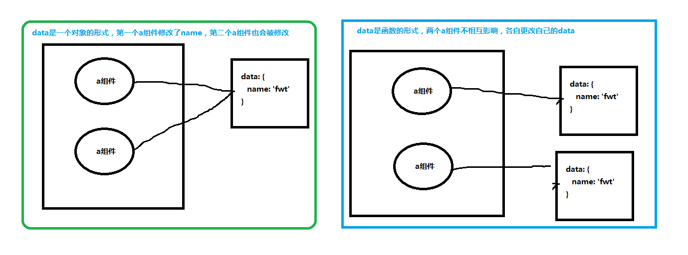

## Vue的数据驱动，响应式数据原理是什么？

- ##### 什么叫数据驱动？

开发人员把重点放在数据及逻辑上，不需要再去关心视图的变化，通过数据的变更动态修改dom，达到数据影响视图的目的。

- ##### Vue的数据驱动原理是什么, 响应式原理是什么？

  1. 在Vue初始化时 initState中，initData将options 的data中的属性全部转为响应式的，通过object.defineProperty()实现对数据的劫持，这也是为什么Vue不支持低版本IE浏览器的原因。看一下源码instance/state.js

     ```js
     export function initState (vm: Component) {
       vm._watchers = [] // 当前实例上定义一个_watchers收集watcher
       const opts = vm.$options
       if (opts.props) initProps(vm, opts.props) // 初始化props
       if (opts.methods) initMethods(vm, opts.methods) // 初始化methods
       if (opts.data) {
         initData(vm) // 初始化data
       } else { // 如果没有data就给一个默认值 {} ,作为根data并设置为响应式
         observe(vm._data = {}, true /* asRootData */)
       }
       if (opts.computed) initComputed(vm, opts.computed) // 初始化computed
       if (opts.watch && opts.watch !== nativeWatch) { // 初始化watch
         initWatch(vm, opts.watch)
       }
     }
     ```

     根据源码我们可以看到`initState` 其实就是对props、methods、data、computed、watch的初始化。我们主要看data的初始化initData

     ```js
     function initData (vm: Component) {
       let data = vm.$options.data
       data = vm._data = typeof data === 'function'
         ? getData(data, vm)
         : data || {} // 判断data是不是一个函数，是就执行getData不是就直接赋值或者给一个默认值
       if (!isPlainObject(data)) { // 如果不是对象就直接抛出错误
         data = {}
         process.env.NODE_ENV !== 'production' && warn(
           'data functions should return an object:\n' +
           'https://vuejs.org/v2/guide/components.html#data-Must-Be-a-Function',
           vm
         )
       }
       // proxy data on instance 代理_data 可以用this.xxx 代替 this._data.xxx
       const keys = Object.keys(data)
       const props = vm.$options.props
       const methods = vm.$options.methods
       let i = keys.length
       while (i--) {
         const key = keys[i]
         if (process.env.NODE_ENV !== 'production') {
           if (methods && hasOwn(methods, key)) {
             warn(
               `Method "${key}" has already been defined as a data property.`,
               vm
             )
           }
         }
         if (props && hasOwn(props, key)) {
           process.env.NODE_ENV !== 'production' && warn(
             `The data property "${key}" is already declared as a prop. ` +
             `Use prop default value instead.`,
             vm
           )
         } else if (!isReserved(key)) {
           proxy(vm, `_data`, key)
         }
       }
       // 上面的代码判断data中是否有与methods，props中的属性名一样的，有就报警告。
       // observe data 重点 执行observe 让data变为响应式
       observe(data, true /* asRootData */)
     }
     ```

     根据上面的代码，总结一下，针对Vue整个实例而言，**data需要是一个对象或者function，针对组件级的data必须是一个函数**。至于为什么必须是函数，这里不展开论述，后面说，然后就是对**data中的属性名与methods、props中的属性名做重复校验，如果重复了就报警告**，为什么不能重复？接下来说，

     **然后代理_data, 最后observe（data, true）作为根实例的data设置为响应式**

  2. 组件级的data为什么必须是一个函数？根实例的data为什么可以是单个对象？

     - 一个页面可能同时引用同一个组件多次，但是这个组件的多次引用，如果data是一个对象的话，每次组件被引用时，data都是用的一个引用地址，有一个组件修改了data，其他的组件就会跟着修改。然而我们并不想做成这样子，所以data是一个函数，函数中返回一个新对象（开辟一块新的内存保存），组件的每次调用都会生成一个属于他自己的data，不会受到影响。

       

     - Vue根实例只有一个，所以data是对象也不会有影响。

       ```js
       // 如果data不是函数的情况，这里用name表示data
       function Animal () {}
       Animal.prototype.name = {
           age: '12'
       }
       var cat = new Animal()
       var dog = new Animal()
       dog.name.age = '20'
       console.log(dog.name.age) // 20
       console.log(cat.name.age) // 20 我只想改变dog.name.age, 无奈cat.name.age也被改了， 因为cat和 dog的name引用了同一块内存地址。
       
       // 如果data是函数
       function Animal() {
           this.name = this.name()
       }
       Animal.prototype.name = function () {
           return {
               age: '12'
           }
       }
       let cat = new Animal()
       let dog = new Animal()
       dog.name.age = '20'
       console.log(dog.name.age) // 20
       console.log(cat.name.age) // 12
       ```

  3. **data中的属性名与methods、props中的属性名做重复校验，如果重复了就报警告，为什么不能重复？**

     ```js
     const vm = new Vue({
         data: {
             name: 'fwt'
         },
         methods: {
             name: () => {
                 return 'fffff'
             }
         }
     })
     console.log(vm.name) // 你想让他执行哪一个呢？所以这里不能重复。只举一个简单的例子，我们举一反三就好
     ```

  4. 然后就是调用`observe`函数使data变为响应式。看一下`observe`

     ```js
     export function observe (value: any, asRootData: ?boolean): Observer | void {
       if (!isObject(value) || value instanceof VNode) { // 判断value是不是对象，或者value是VNode就return
         return
       }
       let ob: Observer | void
       if (hasOwn(value, '__ob__') && value.__ob__ instanceof Observer) { // 判断有没有__ob__ ，__ob__的实例是Observer就直接返返回value.__ob__
         ob = value.__ob__
       } else if (
         shouldObserve &&
         !isServerRendering() &&
         (Array.isArray(value) || isPlainObject(value)) &&
         Object.isExtensible(value) &&
         !value._isVue
       ) {
         ob = new Observer(value) // 实例化一个Observer， 在value上面绑定一个__ob__
       }
       if (asRootData && ob) {
         ob.vmCount++
       }
       return ob
     }
     ```

     `observe`方法就是对value做判断，如果符合就直接返回，不去执行后面的操作，如果不符合就实例化一个`Observer`,接下来看一下`Observer`

     ```js
     export class Observer { // 一个构造函数 es6中叫类class
       value: any;
       dep: Dep;
       vmCount: number; // number of vms that have this object as root $data
     
       constructor (value: any) {
         this.value = value
         this.dep = new Dep()
         this.vmCount = 0
         def(value, '__ob__', this) // 给data对象添加 __ob__ 属性， 值为当前实例 {__ob__: this}
         if (Array.isArray(value)) { // 如果value是数组就递归执行observe
           if (hasProto) {
             protoAugment(value, arrayMethods)
           } else {
             copyAugment(value, arrayMethods, arrayKeys)
           }
           this.observeArray(value)
         } else {
           this.walk(value) // 执行walk
         }
       }
     
       /**
        * Walk through all properties and convert them into
        * getter/setters. This method should only be called when
        * value type is Object.
        */
       walk (obj: Object) {
         const keys = Object.keys(obj)
         for (let i = 0; i < keys.length; i++) {
           defineReactive(obj, keys[i]) // 遍历执行defineReactive ，给value的每个属性设置getter、setter
         }
       }
     
       /**
        * Observe a list of Array items.
        */
       observeArray (items: Array<any>) {
         for (let i = 0, l = items.length; i < l; i++) {
           observe(items[i])
         }
       }
     }
     ```

     `Observer`给value加一个`__ob__`的属性，值赋值为当前实例，然后执行walk操作，遍历调用`defineReactive()`将value的属性都设置getter、setter。源码看一下`defineReactive`

     ```js
     export function defineReactive (
       obj: Object,
       key: string,
       val: any,
       customSetter?: ?Function,
       shallow?: boolean
     ) {
       const dep = new Dep()
     
       const property = Object.getOwnPropertyDescriptor(obj, key)
       if (property && property.configurable === false) {
         return
       }
     
       // cater for pre-defined getter/setters
       const getter = property && property.get
       const setter = property && property.set
       if ((!getter || setter) && arguments.length === 2) {
         val = obj[key]
       }
     
       let childOb = !shallow && observe(val)
       Object.defineProperty(obj, key, {
         enumerable: true,
         configurable: true,
         get: function reactiveGetter () {
           const value = getter ? getter.call(obj) : val
           if (Dep.target) {
             dep.depend() // 此处收集依赖
             if (childOb) {
               childOb.dep.depend()
               if (Array.isArray(value)) {
                 dependArray(value)
               }
             }
           }
           return value
         },
         set: function reactiveSetter (newVal) {
           const value = getter ? getter.call(obj) : val
           /* eslint-disable no-self-compare */
           if (newVal === value || (newVal !== newVal && value !== value)) {
             return
           }
           /* eslint-enable no-self-compare */
           if (process.env.NODE_ENV !== 'production' && customSetter) {
             customSetter()
           }
           // #7981: for accessor properties without setter
           if (getter && !setter) return
           if (setter) {
             setter.call(obj, newVal)
           } else {
             val = newVal
           }
           childOb = !shallow && observe(newVal)
           dep.notify() // 调用watcher的update，去更新DOM
         }
       })
     }
     ```

     为value的属性添加getter、setter。当使用value中的值是就会触发getter进行依赖收集，修改value中的值时就会触发setter，然后触发dep.notify()，调用watcher.update()方法去更新DOM。

     ## 总结：

     数据达到响应式的流程分为以下几点

     1. data中的属性不能与props、methods、computed中的属性重复；
     2. 给data添加`__ob__`属性,确保下次遇到直接返回。
     3. 执行defineReactive函数给data中的属性添加getter和setter，达到数据响应;

  

  

  **接下来讲解依赖收集与watcher的关系。**小伙伴们可以参与进来，一起学习。